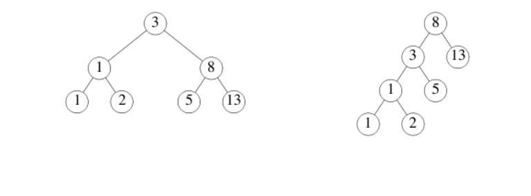

Có thể có nhiều cây nhị phân khác nhau với cùng chuỗi giá trị được lưu trữ trong
nó.    
Ví dụ: ở đây có hai cây nhị phân lưu trữ chuỗi: 1, 1, 2, 3, 5, 8, 13    



Một hàm để kiểm tra xem hai cây nhị phân có lưu cùng một chuỗi hay không là
khá phức tạp trong hầu hết các ngôn ngữ. Chúng ta sẽ sử dụng Go’s concurrency và channels để cài đặt một giải pháp đơn giản.

Ví dụ sau sử dụng kiểu cấu trúc tên Tree:
```
type Tree struct {
    Left *Tree
    Value int
    Right *Tree
}
```

1. Cài đặt hàm Walk
2. Kiểm tra hàm Walk
Hàm tree.New(k) xây dựng một cây nhị phân cấu trúc ngẫu nhiên (nhưng luôn
được sắp xếp) chứa các giá trị k, 2k, 3k, …, 10k
Tạo một kênh ch và khởi động walker:
go Walk(tree.New(1), ch)
Sau đó đọc và in 10 giá trị từ kênh. Nó phải là các số: 1, 2, 3, ..., 10.
3. Cài đặng hàm Same sử dụng Walk để xác định xem t1 và t2 có lưu cùng giá
trị hay không.
4. Kiểm tra hàm Same
Same(tree.New(1), tree.New(1)) sẽ trả về true, và Same(tree.New(1),
tree.New(2)) sẽ trả về false
Tài liệu về Tree có thể tham khảo tại đây
(https://godoc.org/golang.org/x/tour/tree#Tree)
